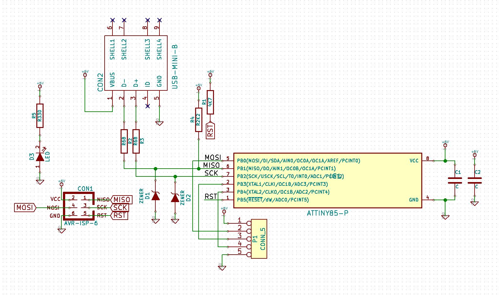

## fade - A fancier attempt at a dedicated volume control

### Work in progress

This is a generalized development board for V-USB, using the ATTiny85 without a
crystal.

The board files are free for re-use, modification, and manufacture without
restriction.

The repository here contains KiCAD sources (schematic/board files),
basic V-USB code that implements a key-based HID media controller
(with modifications for this board) and a Bill of Materials listing.

***Note***: The VID/PID need to be properly defined before using this board in
production. This should be your own VID/PID, or from a source such as
[http://pid.codes](http://pid.codes).

## Usable pins

| Pin on ATTiny | Goes to | Connected to ISP as
|---|---|---|
| PB0 | Pin 2 on connector | MOSI
| PB3 | Pin 3 on connector | Not Connected
| PB4 | Pin 4 on connector | Not Connected

## Bill of Materials

#### This builds one board

| Quantity | Placement | Description | Digikey Part Number | Notes |
|---|---|---|---|---|
|1|Center, with corner dot aligned to silkscreened dot |ATTiny85 (PDIP)|ATTINY85-20PU-ND|ATTiny in PDIP format
|1|2.2K|2.2K ohm resistor|1276-5070-1-ND|Pull-up resistor for D- (0603 imperial)
|1|4.7K|4.7k ohm resistor|P4.7KGCT-ND|Pull-up resistor for AVR RESET line (0603 imperial)
|1|C1|10uF 16V 20% X6S capacitor|490-10499-1-ND|Bypass at USB input (0805 imperial)
|1|C2|0.1uF capacitor|490-1532-1-ND|Just buy a bunch. Singles are expensive! (0603 imperial)
|1|USB box at board edge (4 pads with plated through-holes)|USB connector|WM17116CT-ND|Mini USB-B
|2|68R|68 ohm resistor|311-68GRCT-ND|USB data terminators (0603 imperial)
|2|D1+D2 with striped side opposite board markings|3.6V Zener diode|BZT52C3V6-E3-08-ND|SOD123 format

#### Optional components

| Quantity | Placement | Description | Digikey Part Number | Notes
|---|---|---|---|---|
|1|ATTiny footprint (aligned with the U silk)|8 pin DIP socket|A120347-ND|The older socket used in prototypes was P/N 390261-2 and was discontinued
|1|330R|330 ohm resistor|1276-5050-1-ND|Current limiting resistor for PWR LED
|1|Next to 330R (+ - silk)|Power LED|475-2512-1-ND|Red LED 0603 imperial
|1|+5V / GND silk-screened box|Right angle 1x5 female header|S5480-ND|For connecting to carrier boards (female header)
|1|+5V / GND silkscreened box|Right angle 1x5 male header|S1121E-05-ND|For connecting to carrier boards (male header)
|1|2x3 header|6 pin AVR ISP header|3M9459-ND|For flashing the ATTiny85

## Flashing firmware

Ensure that you have all the avr tools necessary to compile the firmware. On
Debian/Ubuntu based systems the dependencies are:

    sudo apt-get install -y build-essential gcc-avr gdb-avr binutils-avr avr-libc avrdude

In the firmware directory (depending on how your system permissions are setup pre-pending `sudo` may be necessary):

    cd firmware
    make hex
    make program
    make fuse

## Fuses (important)

These must be programmed, otherwise your board will not
enumerate with the host.

    avrdude -c buspirate -p attiny85 -P /dev/ttyUSB0
     -U hfuse:w:0xdd:m -U lfuse:w:0xe1:m

## Schematic

#### License

Board files, schematic and PCB are **CC0 1.0 Universal**.

V-USB firmware and accompanying source code is **GPL 2.0 licensed**.

For more information and full license text, see the LICENSE.md file in this
repository.
